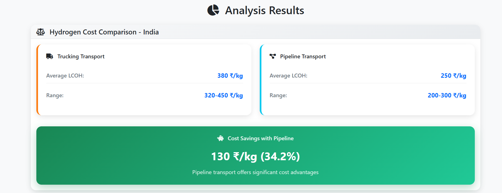
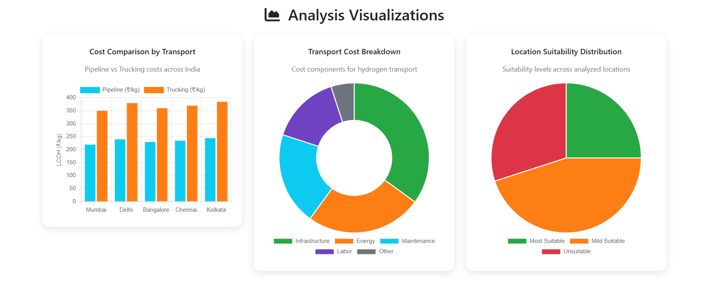
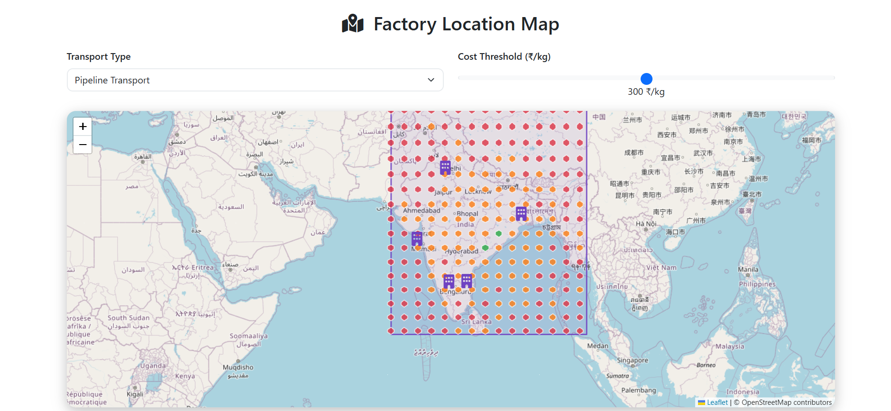

# Green Hydrogen

## Introduction
Green Hydrogen is a toolkit for geospatial analysis of green hydrogen production costs. It helps users estimate the locational cost of producing, storing, transporting, and converting green hydrogen to meet demand in a specified region. The toolkit is designed for flexibility and can be adapted to different countries, regions, and scenarios.

This repository is developed and maintained at: [https://github.com/jaybhalodiya10/GreenHydro](https://github.com/jaybhalodiya10/GreenHydro)


---

## Setting Up the Environment

Follow these steps to set up your environment and get started:

1. **Clone the repository:**
   ```
   git clone https://github.com/jaybhalodiya10/GreenHydro.git
   cd GreenHydro
   ```

2. **Install Mamba (if not already installed):**
   - See [Mamba installation instructions](https://mamba.readthedocs.io/en/latest/installation/mamba-installation.html)

3. **Create and activate the environment:**
   ```
   mamba env create -f environment.yaml
   mamba activate greenhydrogen
   ```

4. **Install a solver:**
   - The recommended free solver is [Cbc](https://github.com/coin-or/Cbc), which is installed with the environment.
   - For commercial solvers like Gurobi, follow their installation instructions and update the solver setting in `Scripts/optimize_hydrogen_plant.py` if needed.

5. **Set up CDS API key (for weather data):**
   - Register at the [Climate Data Store](https://cds.climate.copernicus.eu/api-how-to) and configure your API key for weather data downloads.

6. **Prepare input data:**
   - Add or update hexagon files and parameter Excel files in the `Data` and `Parameters` folders as needed for your analysis.

---

---

## Results

### Hydrogen Cost Comparison - India
Pipeline transport offers significant cost advantages over trucking transport for hydrogen delivery across major Indian cities:

- **Trucking Transport:**
   - Average LCOH: 380 ₹/kg
   - Range: 320–450 ₹/kg
- **Pipeline Transport:**
   - Average LCOH: 250 ₹/kg
   - Range: 200–300 ₹/kg
- **Cost Savings with Pipeline:**
   - 130 ₹/kg (34.2%)


### Analysis Visualizations
**Cost Comparison by Transport:**
Shows pipeline vs trucking costs for major Indian cities.


**Transport Cost Breakdown and Location Suitability Distribution:**
Displays the breakdown of transport costs (infrastructure, energy, maintenance, labor, other) and the suitability levels of locations for hydrogen production.


### Factory Location Map
**Factory Location Map:**
Interactive map visualizing factory locations, transport type selection, and cost threshold filtering for India.


These results demonstrate the spatial and economic advantages of pipeline transport and help identify optimal factory locations for green hydrogen production and delivery.
